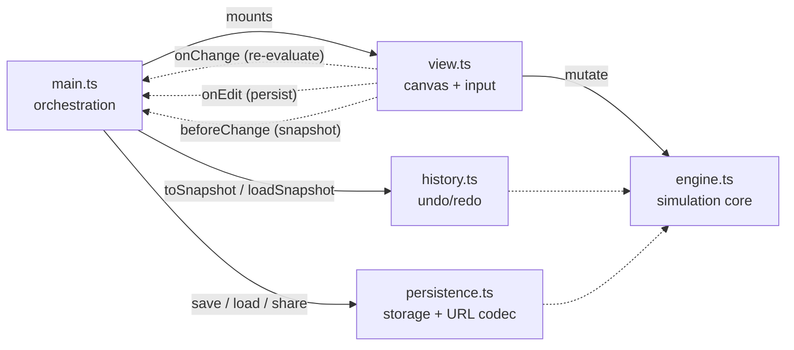

<p align="center">
  
</p>

<h1 align="center">LogicLab</h1>
<p align="center"><b>A beginner-friendly, browser-based sandbox for digital logic circuits.</b></p>

<p align="center">
  <a href="https://github.com/kaan84k/LogicLab/actions/workflows/ci.yml"></a>
  
  
</p>

Drop components on a canvas, wire them together, flip switches, and watch
signals propagate in real time. No framework, no bundler, no dependencies at
runtime — just TypeScript compiled to native ES modules.

## Contents

- [Features](#features)
- [Quick start](#quick-start)
- [Controls](#controls)
- [Architecture](#architecture)
- [Development](#development)
- [Roadmap](#roadmap)

## Features

- **Components** — input switches, constant HIGH/LOW, a CLOCK source, NOT,
  AND, OR, NAND, NOR, XOR, XNOR gates, and output LEDs.
- **Multi-input gates** — grow AND/OR/NAND/NOR/XOR/XNOR up to 8 inputs.
- **Live simulation** with oscillation detection for unstable feedback loops.
- **Truth-table generator** for any circuit of switches → LEDs.
- **Edit tools** — selection, box-select, group move, delete, undo/redo,
  copy/paste/duplicate, gate labels, grid snapping.
- **Navigation** — pan (middle-mouse / Space-drag / two-finger scroll), zoom
  (pinch / Ctrl-scroll), fit-to-content, and a minimap.
- **Persistence & sharing** — autosave to `localStorage`, a named-circuit
  gallery, JSON import/export, and shareable `#`-hash links.
- **Accessibility** — full keyboard operation, a screen-reader outline with
  live announcements, a colorblind-safe palette, and `prefers-reduced-motion`
  support.

## Quick start

```bash
git clone https://github.com/kaan84k/LogicLab.git
cd LogicLab
npm install      # dev dependencies only (TypeScript + tooling)
npm start        # compile and serve on a local static server
```

Then open the served URL (e.g. <http://localhost:3000>). During development,
recompile on save with:

```bash
npm run watch    # recompile src/ → dist/ on change
```

`index.html` loads the compiled ES modules from `dist/` directly — there's no
bundler in the loop.

## Controls

| Action              | How                                                     |
| -------------------- | -------------------------------------------------------- |
| Place a component     | Pick one from the palette, then click the canvas          |
| Wire                 | Drag from an output pin (right) to an input pin (left)     |
| Move / group move     | Drag a component body; box-select then drag many          |
| Toggle a switch       | Click it                                                  |
| Select / add          | Click a gate or wire; `Shift`+click to add                |
| Delete                | Select, then `Delete`                                     |
| Undo / redo           | `Ctrl+Z` / `Ctrl+Y` (or `Ctrl+Shift+Z`)                   |
| Copy / paste / dup    | `Ctrl+C` / `Ctrl+V` / `Ctrl+D`                            |
| Add / remove input    | Select a multi-input gate, then `+` / `−`                 |
| Rename                | Right-click a gate, or double-click it                    |
| Pan                   | Middle-mouse drag, hold `Space`, or two-finger scroll     |
| Zoom                  | Pinch, or `Ctrl`+scroll                                   |
| Fit to content        | `F`, or the "Fit to Content" button                       |

**Keyboard-only:** `Tab` to the canvas, then arrows to move between gates,
`Shift`+arrows to reposition, `Enter` to toggle/drop, and `W` for two-step
wiring.

## Architecture

The code is split into small, single-responsibility modules under `src/`,
communicating in one direction: `main` and `view` call into `engine`; `view`
notifies `main` via hooks for re-evaluation, persistence, and undo snapshots.



- **`engine.ts`** — the pure simulation core. Owns the data model (gates,
  pins, wires) and settles logic values via an iterative fixed-point loop.
  Has no DOM or rendering knowledge, which makes it easy to unit-test.
- **`view.ts`** — all `<canvas>` rendering and pointer/touch/keyboard
  interaction. Owns the viewport transform and translates raw events into
  engine mutations. Redraws only when dirty.
- **`history.ts`** — snapshot-based undo/redo, built on the engine's
  `toSnapshot()` / `loadSnapshot()`.
- **`persistence.ts`** — validation, version migration, `localStorage`
  autosave, the named-circuit gallery, and URL-hash sharing.
- **`main.ts`** — boots the engine + view, wires up the sidebar UI, keyboard
  shortcuts, and accessibility announcements.

## Development

```bash
npm run build          # tsc → dist/
npm run typecheck      # tsc --noEmit
npm test               # compile + run engine unit tests (node:test)
npm run lint           # eslint
npm run format         # prettier --write
npm run format:check   # prettier --check
```

CI (GitHub Actions) runs typecheck, lint, format check, tests, and build on
every push and pull request.

## Roadmap

Planned and completed work is tracked in [`IMPROVEMENTS.md`](./IMPROVEMENTS.md),
grouped by theme (interaction, components, simulation, persistence, UX,
accessibility, tooling, performance).

---

Contributions are welcome — open an issue or pull request.
